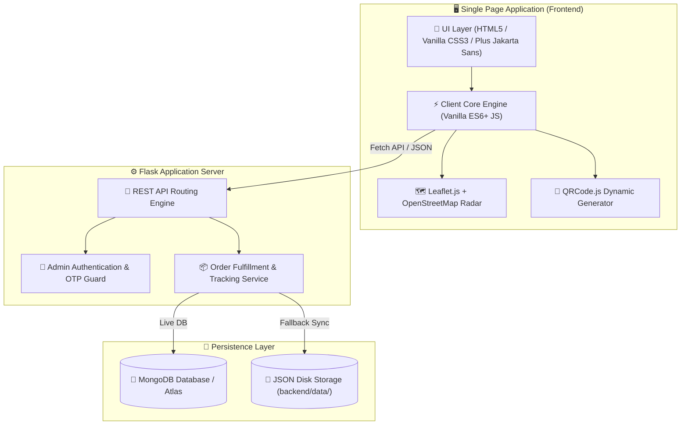

<div align="center">

# 📦 SwiftTrack
### *Enterprise-Grade Real-Time Order Tracking & Logistics Fulfillment Platform*

[](https://www.python.org/)
[](https://flask.palletsprojects.com/)
[](https://www.mongodb.com/)
[](https://leafletjs.com/)
[](LICENSE)

<br/>

**SwiftTrack** is a high-performance, single-page logistics tracking and warehouse management application. Designed with a clean **Off-White & Warm Amber** theme (`#FDFDFB`, `#F59E0B`), it delivers end-to-end parcel visibility with interactive GPS map routing, dynamic scannable QR passes, OTP-gated physical delivery verification, and post-delivery customer reviews.

[Explore Features](#-core-features) • [Quick Start](#-quick-start) • [Architecture](#-system-architecture) • [API Reference](#-api-endpoints) • [Tech Stack](#-technology-stack)

</div>

---

## 📑 Table of Contents
- [✨ Core Features](#-core-features)
- [🏗️ System Architecture](#️-system-architecture)
- [💻 Technology Stack](#-technology-stack)
- [🚀 Quick Start](#-quick-start)
- [🔐 Demo Credentials & Sample Data](#-demo-credentials--sample-data)
- [📡 API Endpoints](#-api-endpoints)
- [📁 Folder Structure](#-folder-structure)
- [⚙️ Configuration & Environment Variables](#️-configuration--environment-variables)
- [🤝 Contributing](#-contributing)
- [📄 License](#-license)

---

## ✨ Core Features

### 👤 Customer Experience Portal
- **⚡ Single-Page Architecture (SPA)**: Zero page reloads — smooth transitions, real-time feedback banners, and reactive search.
- **🛒 Instant Order Placement**: Place orders with customer details, item quantities, price calculations, and warehouse origin points.
- **📈 6-Step Visual Milestone Stepper**: Real-time progression tracking through (*Order Placed* → *Confirmed* → *Packed* → *Shipped* → *Out for Delivery* → *Delivered*).
- **🗺️ Interactive Logistics Map (Leaflet.js + OpenStreetMap)**:
  - Plots origin warehouses (🏭), intermediate sorting hubs (🚚), live dispatch beacons (📍 with pulsing radar animation), and destination addresses (🏠).
  - Connects journey points with dynamic polyline route curves without requiring external paid API keys.
- **📲 Dynamic QR Code Generator (`qrcode.js`)**: Automatically generates a scannable QR pass encoding the order URL (`/?track=ORD...`) for instant mobile verification.
- **🔑 Secure 4-Digit Delivery OTP**: Unique verification PIN generated per order for secure parcel handover.
- **📄 Printable Order Receipts**: Modal with invoice breakdown, taxes, shipping, customer details, and print-ready CSS formatting.
- **⭐ Post-Delivery Feedback & 5-Star Reviews**: Rating and feedback box revealed automatically upon package delivery, stored directly in the database.

---

### 🛡️ Operations & Admin Management Console
- **🔐 PIN-Protected Access Control**: Restricted management portal with customizable administrative PIN authentication.
- **📊 Real-Time Operations Metrics**: Live counters for Total Orders, Pending/Processing, In-Transit/Shipped, and Delivered packages.
- **🔄 Live Status Dispatcher**: Real-time status transitions and custom delivery hub assignments with instant sync to the customer tracking view.
- **🔒 OTP-Gated Delivery Verification**: Enforces security by requiring administrators or courier agents to enter the customer's 4-digit OTP before marking an order as *Delivered*.
- **⚙️ Configurable Hub & Security Settings**: Manage active fulfillment hubs, dispatch stations, and update administrator passcodes dynamically.
- **📥 Instant CSV Data Export**: One-click download of full order logs, delivery OTPs, timestamps, and customer ratings into standard `.csv` spreadsheets.

---

### 💾 Dual-Engine Intelligent Persistence Layer
- **Live MongoDB Connection**: Automatically connects to local MongoDB instances or **MongoDB Atlas Cloud Clusters** via `MONGO_URI`.
- **Zero-Setup Disk Fallback (`mongomock` + JSON Persistence)**: If MongoDB is not installed, the app automatically activates an in-memory virtual database backed by persistent disk storage (`backend/data/orders.json` & `backend/data/settings.json`), ensuring **zero data loss across server restarts**.

---

## 🏗️ System Architecture



---

## 💻 Technology Stack

| Layer | Technology | Purpose |
| :--- | :--- | :--- |
| **Backend Framework** | **Python 3.10+ / Flask 3.1+** | Lightweight, high-performance RESTful API microservice |
| **CORS Middleware** | **Flask-CORS** | Cross-Origin Resource Sharing handling |
| **Database Driver** | **PyMongo 4.6+** | Official MongoDB driver for BSON/JSON operations |
| **In-Memory Fallback** | **mongomock 4.3+** | Virtual in-memory MongoDB mock engine |
| **UI Structure** | **HTML5 (Semantic SPA)** | Clean, accessible single-page layout |
| **Design System** | **Modern Vanilla CSS3** | Custom design tokens, glassmorphism, responsive CSS grid/flexbox |
| **Typography** | **Plus Jakarta Sans & Outfit** | Modern, readable Google Fonts |
| **Geospatial Mapping** | **Leaflet.js 1.9+ & OpenStreetMap** | Zero-API-key interactive map routing & live radar markers |
| **QR Code Engine** | **QRCode.js** | Client-side scannable barcode generator |

---

## 🚀 Quick Start

### 1. Clone the Repository
```bash
git clone https://github.com/shyamsundarmd19-hub/order-tracking-.git
cd order-tracking-
```

### 2. Install Dependencies
```bash
cd backend
pip install -r requirements.txt
```

### 3. Start the Server
```bash
python app.py
```

### 4. Launch Application
Open your browser and visit:
```text
http://127.0.0.1:5000
```

---

## 🔐 Demo Credentials & Sample Data

| Role / Entity | Identifier | Default Security PIN / OTP | Notes |
| :--- | :--- | :--- | :--- |
| **Administrator** | `Admin Portal` | `admin123` | Unlocks management console & settings |
| **In-Transit Shipment** | `ORD1001` | OTP: `4821` | Live route on interactive radar map |
| **Delivered Shipment** | `ORD1002` | OTP: `7392` | Includes verified 5-star customer review |
| **New Orders** | Sequential (`ORD1003`+) | Auto-Generated 4-digit PIN | Instantly trackable with persistent auto-save |

---

## 📡 API Endpoints

### 🛒 Customer Endpoints
| Method | Endpoint | Description |
| :--- | :--- | :--- |
| `GET` | `/` | Serves the Single-Page Application interface |
| `POST` | `/api/orders` | Create a new order with auto-generated 4-digit OTP & estimated delivery |
| `GET` | `/api/orders/<order_id>/track` | Fetch real-time order status, OTP, and milestone history |
| `PUT` | `/api/orders/<order_id>/cancel` | Cancel order (valid only in *Order Placed* status) |
| `POST` | `/api/orders/<order_id>/review` | Submit 5-star customer rating and feedback comment |

### 🛡️ Admin & Logistics Endpoints
| Method | Endpoint | Description |
| :--- | :--- | :--- |
| `POST` | `/api/admin/verify-pin` | Authenticate administrative PIN |
| `GET` | `/api/admin/orders` | Retrieve all orders (supports `?status=` filter) |
| `PUT` | `/api/admin/orders/<order_id>/status` | Update status & milestone location (**requires OTP for *Delivered***) |
| `GET` | `/api/admin/metrics` | Returns order counts and status breakdown analytics |
| `GET` | `/api/admin/settings` | Fetch administrator PIN and active hub registry |
| `PUT` | `/api/admin/settings` | Update security PIN and active delivery hubs |
| `GET` | `/api/admin/export` | Download structured CSV spreadsheet of all orders and reviews |

---

## 📁 Folder Structure

```text
order-tracking-/
├── backend/
│   ├── app.py                  # Core Flask server, REST APIs & persistence manager
│   ├── requirements.txt        # Python package dependencies
│   └── data/                   # Persistent storage directory
│       ├── orders.json         # Auto-saved order registry
│       └── settings.json       # Auto-saved configuration & dispatch hubs
├── frontend/
│   ├── templates/
│   │   └── index.html          # SPA markup with modals, map & timeline
│   └── static/
│       ├── css/
│       │   └── style.css       # White + Mild Warm Amber design tokens & components
│       └── js/
│           └── app.js          # Client controller, Leaflet map, QR & API integration
├── .gitignore                  # Git ignore rules for Python & OS artifacts
└── README.md                   # Project documentation
```

---

## ⚙️ Configuration & Environment Variables

SwiftTrack works out-of-the-box with zero configuration. Optional environment variables can be set:

| Variable | Default Value | Description |
| :--- | :--- | :--- |
| `PORT` | `5000` | Port on which the Flask server listens |
| `MONGO_URI` | `mongodb://localhost:27017/` | Connection string for local MongoDB or MongoDB Atlas |

To connect to **MongoDB Atlas Cloud**, set the environment variable:
```bash
export MONGO_URI="mongodb+srv://<username>:<password>@cluster.mongodb.net/?retryWrites=true&w=majority"
```

---

## 🤝 Contributing

Contributions, issues, and feature requests are welcome!
1. Fork the Project (`https://github.com/shyamsundarmd19-hub/order-tracking-/fork`)
2. Create your Feature Branch (`git checkout -b feature/AmazingFeature`)
3. Commit your Changes (`git commit -m 'Add some AmazingFeature'`)
4. Push to the Branch (`git push origin feature/AmazingFeature`)
5. Open a Pull Request

---

## 📄 License

Distributed under the **MIT License**. See [`LICENSE`](LICENSE) for more information.

<div align="center">
  <sub>Built with ❤️ by <a href="https://github.com/shyamsundarmd19-hub">Shyam Sundar</a></sub>
</div>
